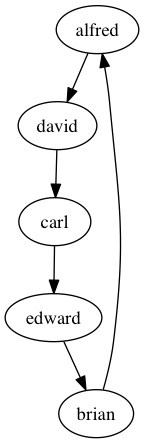

# Secret Santa

This is Secret Santa, a Secret Santa engine written in Ruby.

### Installation & Usage

Add to gemfile:
```
gem 'secret_santa', '~> 0.0.2'
```
Or install:
```
gem install secret_santa
```
Run the executable:
```
$ secret_santa
Enter each name in the Secret Santa pool, separated by a space:
=> alfred brian carl david edward

2014 Secret Santa List:
carl -> david
brian -> carl
alfred -> brian
edward -> alfred
david -> edward

List saved to 2014_secret_santa_list.png
```
This creates a graph like this in your current directory:



### Contributing

If you'd like to contribute to Secret Santa, please submit a pull request via Github.
